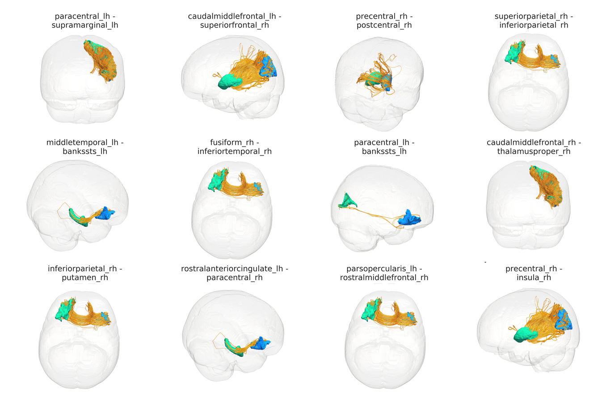

# ConWhAt - a library for Connectome-based White matter Atlas analyses

***Note - major refactoring in progress. Most things not working and/or implemented yet. Please come back soon!***

##Overview

Conventional approaches to atlasing white matter structures follow a *tract-based* ontology: they assign locations in stereotaxic space to a relatively small number of gross white matter tracts from the classical neuroanatomy literature. 

Problem is, they aren't particularly well-suited to network-based descriptions of brain organization. 

Connectome-based white matter atlases take a different approach: they follow a *connectivity-based* ontology. The idea here is rather than following the classical anatomical tract nomenclature, to label white matter voxels according to the grey matter regions that their constituent fibers interconnect.

The benefit of this approach is that a scientist/clinician/citizen can take a set of (standard space) coordinates, or a nifti-format ROI mask such as a binary lesion map, and straightforwardly query which grey matter region pairs (i.e. connectome-edges) have fibers passing through those locations.

That information can then be used together with the used parcellation's *canonical connectome* (normative group-averaged connectivity matrix), to obtain a lesion-modified structural (macro) connectome. This can be done very quickly with zero tractography data or analysis required, and as little as a list of numbers (voxel coordinates) as input. 

##Installation

Grab from github

`git clone https://github.com/JohnGriffiths/ConWhAt`

Edit config file with external package directory locations, etc. 

`...`

##Usage

Volumetric connectivity-based atlas analyais

`from ConWhAt.volumetric import VolConnAtlas`
`vca = VolConnAtlas()`

Volumetric tract-based atlas analysis

`from ConWhAt.volumetric import VolConnAtlas`  
`vca = VolConnAtlas()`

Streamlinetric connectivity-based atlas analyss

`from ConWhAt.streamlinetric import StreamConnAtlas`  
`sca = StreamTractAtlas()`

Streamlinetric tract-based atlas analysis

`from ConWhAt.streamlinetric import StreamTractAtlas`  
`sta = StreamTractAtlas()`

##More deets

##Atlas Construction

##Volumetric Atlas

##Streamlinetric Atlas

